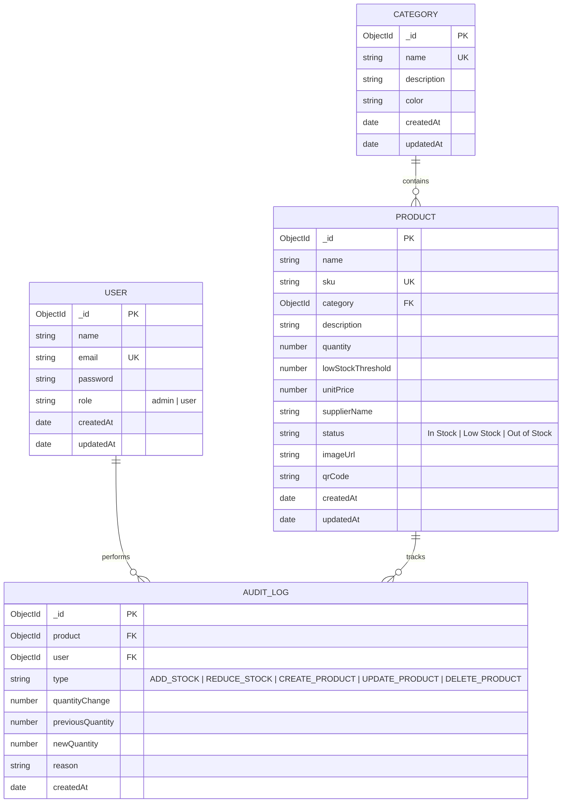

# 📦 RED SOFTWARE - Full Stack CRUD Inventory Management System

A responsive, scalable, full-stack **Inventory Management System** built with **Node.js, Express, MongoDB (Mongoose), and React**.

This project provides a clean user interface, JWT authentication, role-based authorization, inventory telemetry dashboards, full CRUD operations, stock management with audit trails, QR code generation, CSV export/import, dark mode toggle, and containerized Docker support.

---

## 🌟 Key Features & Functional Modules

### 1. 🔐 Authentication & Authorization
- **JWT-based Security**: Secure token issuance with 7-day expiration.
- **User Registration & Login**: Validated email/password authentication.
- **Role-Based Access Control (RBAC)**:
  - **Administrator (`admin`)**: Full access including product deletion, category management, CSV import, and bulk actions.
  - **Standard User (`user`)**: Can view catalog, search/filter, and perform stock adjustments.
- **Demo Quick-Fill Credentials** on login screen for instant evaluation.

### 2. 📊 Interactive Dashboard & Telemetry
- **KPI Summary Cards**: Total Products, Total Categories, Total Stock Units, Low Stock Alert Count, Out of Stock Count, and Total Inventory Asset Valuation ($).
- **Visual Analytics**: Interactive Category Stock Distribution bar chart and Stock Status breakdown pie chart (powered by Recharts).
- **Replenishment Alert Feed**: Immediate notification list for items below low stock threshold.
- **Recent Audit Trail**: Real-time activity feed showing latest stock adjustments.

### 3. 🛍️ Product Management (CRUD)
- **Fields**: Product Name, SKU (Unique), Category, Description, Quantity, Low Stock Threshold, Unit Price, Supplier Name, Status (`In Stock`, `Low Stock`, `Out of Stock`), Image URL, QR Code, and Timestamps.
- **Automatic Stock Status**: Automatically computed based on quantity (`0` = Out of Stock, `<= threshold` = Low Stock, `> threshold` = In Stock).
- **Search, Filter & Sorting**: Real-time search by product name/SKU, category dropdown filter, stock status filter, and multi-field sorting.
- **Pagination**: Server-side pagination controls for scalable rendering.

### 4. 🏷️ Category Management
- Create, edit, and delete categories with custom hex badge colors.
- Product assignment count tracking per category.
- Protection against deleting categories assigned to existing products.

### 5. 📈 Stock Management & Audit Trail
- **Stock Adjustment**: Increase (`+`) or decrease (`-`) inventory with mandatory reason logging.
- **Negative Stock Prevention**: Server-side checks preventing inventory from dipping below 0.
- **Historical Ledger**: Dedicated Audit Logs tab showing user, product, quantity change, prior/new stock level, and date timestamps.

### 6. 🎁 Bonus Features Implemented
- **QR Code Generation**: Auto-generated QR code for product SKUs (viewable in detail modal).
- **Product Image Upload**: File upload handler via Multer statically served at `/uploads`.
- **CSV Export & Import**:
  - Export full inventory catalog to formatted `.csv`.
  - Import bulk products from `.csv` with SKU duplication checking.
- **Swagger / OpenAPI Documentation**: Interactive API doc endpoint available at `http://localhost:5000/api-docs`.
- **Automated API Testing**: Integration test suite using Jest and Supertest.
- **Dark Mode / Light Mode**: Dynamic visual theme switcher.
- **Docker Support**: Containerized configuration (`Dockerfile` and `docker-compose.yml`).

---

## 🗄️ Database Schema / ER Diagram



---

## 🚀 Getting Started

### Option A: Local Execution (Recommended for Development)

#### Prerequisites
- Node.js (v18+)
- MongoDB running locally at `mongodb://127.0.0.1:27017`

#### 1. Setup Backend (`server`)
```bash
cd server
npm install
node seed.js  # Seeds demo users, categories & products
npm start     # Runs backend server at http://localhost:5000
```

*Backend runs at `http://localhost:5000`*
*Swagger API Docs at `http://localhost:5000/api-docs`*

#### 2. Setup Frontend (`client`)
Open a new terminal window:
```bash
cd client
npm install
npm start
```

*Frontend runs at `http://localhost:3000`*

---

### Option B: Docker Container Deployment

```bash
docker-compose up --build
```
This command starts MongoDB, Express Server, and React Client in isolated containers.

---

## 🔑 Demo Login Credentials

You can use the **Quick-Fill Demo buttons** on the login page or enter manually:

| Role | Email | Password | Permissions |
|---|---|---|---|
| **Administrator** | `admin@redsoftware.com` | `admin123` | Full access (Add/Edit/Delete, CSV Import, Categories) |
| **Standard User** | `user@redsoftware.com` | `user123` | View catalog, Search/Filter, Stock adjustments |

---

## 🧪 Running Automated API Tests

To execute the backend integration test suite:

```bash
cd server
npm test
```

---

## 📡 API Endpoints Overview

| Method | Endpoint | Access | Description |
|---|---|---|---|
| `POST` | `/api/auth/register` | Public | Register new user |
| `POST` | `/api/auth/login` | Public | Login & obtain JWT token |
| `GET` | `/api/auth/me` | Private | Get profile of logged in user |
| `GET` | `/api/dashboard` | Private | Retrieve dashboard metrics & stats |
| `GET` | `/api/products` | Private | List products (Search, Filter, Pagination, Sort) |
| `POST` | `/api/products` | Private | Create new product |
| `GET` | `/api/products/:id` | Private | Get single product details |
| `PUT` | `/api/products/:id` | Private | Update product details |
| `DELETE` | `/api/products/:id` | Admin | Delete product |
| `GET` | `/api/products/export/csv` | Private | Export inventory to CSV file |
| `POST` | `/api/products/import/csv` | Admin | Import inventory from CSV file |
| `GET` | `/api/categories` | Private | List categories with product counts |
| `POST` | `/api/categories` | Admin | Create category |
| `PUT` | `/api/categories/:id` | Admin | Update category |
| `DELETE` | `/api/categories/:id` | Admin | Delete category |
| `POST` | `/api/stock/adjust` | Private | Adjust product quantity (+ or -) |
| `GET` | `/api/stock/history` | Private | Retrieve inventory audit logs |

---

## 💡 Assumptions & Design Trade-offs

1. **Automatic Stock Status**: Status is computed server-side in a pre-save hook based on `quantity` and `lowStockThreshold` to maintain data integrity.
2. **SKU Immutability & Uniqueness**: SKUs are forced to uppercase and checked for uniqueness.
3. **Database Seeding**: The `seed.js` script allows evaluators to immediately test a populated database without manual data entry.
4. **Audit Trail**: Every inventory creation, stock modification, and deletion generates an immutable `AuditLog` entry.

---

## 📁 Repository Structure

```
Inventory_Management_System/
├── client/                 # React Frontend Application
│   ├── src/
│   │   ├── components/    # Navbar, Sidebar, Modal, Toast, Spinner
│   │   ├── context/       # AuthContext, ThemeContext
│   │   ├── pages/         # Dashboard, ProductList, CategoryList, AuditLogList, Login, Register
│   │   ├── services/      # Axios API client
│   │   ├── App.js
│   │   └── index.css      # Custom Glassmorphism Design System
│   └── Dockerfile
├── server/                 # Express REST API Backend
│   ├── controllers/       # Auth, Product, Category, Stock, Dashboard
│   ├── middleware/        # JWT Auth, Multer File Upload
│   ├── models/            # User, Product, Category, AuditLog Mongoose schemas
│   ├── routes/            # Express route files
│   ├── tests/             # Jest / Supertest integration tests
│   ├── swagger.js         # Swagger OpenAPI 3.0 specification
│   ├── seed.js            # Database seed script
│   ├── server.js          # App entry point
│   └── Dockerfile
├── docker-compose.yml     # Multi-container orchestrator
├── postman_collection.json# Postman Collection deliverable
└── README.md              # Project documentation
```